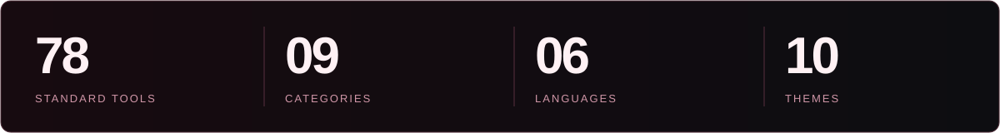
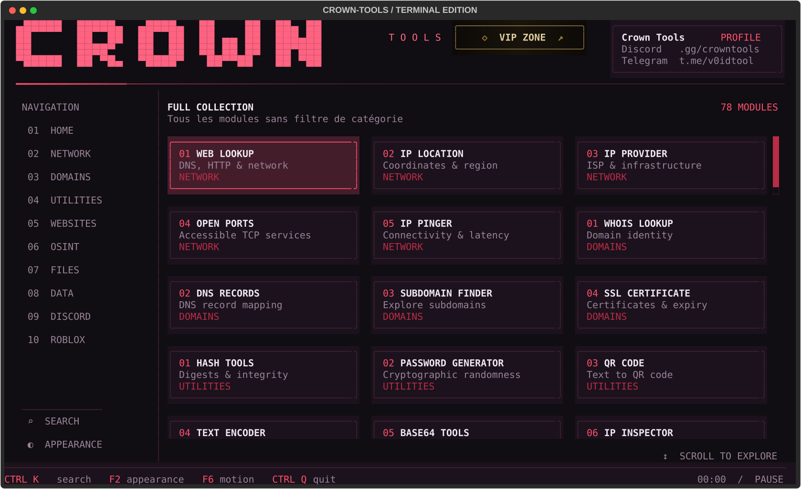
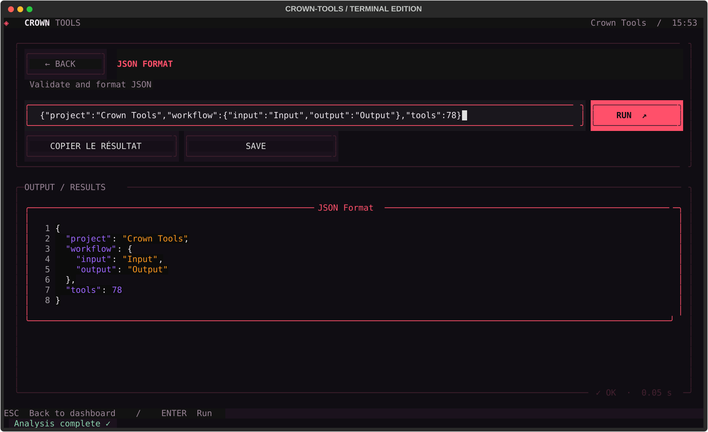
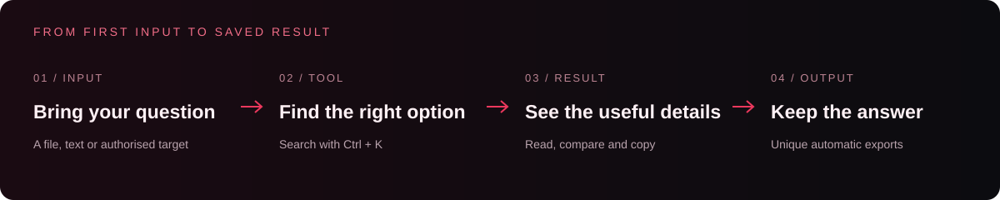
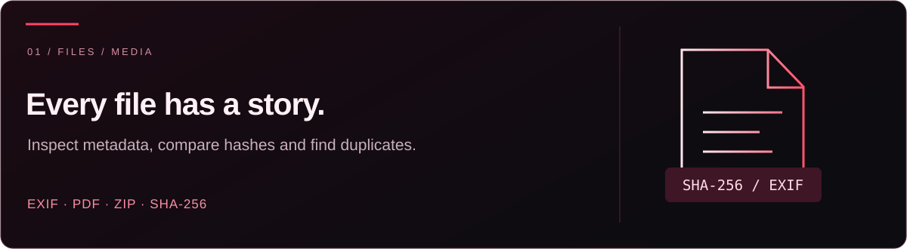
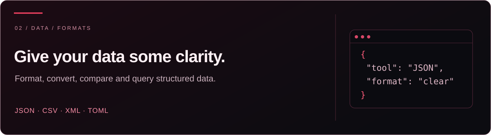
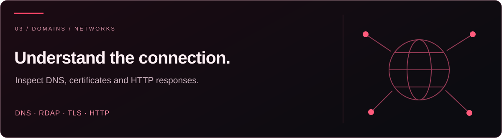

<div align="center">


### Inspect. Understand. Keep the result.

**A searchable workspace for file analysis, structured data and authorised diagnostics.**

[](#start-in-three-steps)
[](#start-in-three-steps)
[](#start-in-three-steps)

<a href="#start-in-three-steps"></a>
<a href="https://discord.gg/kaostools"></a>
<a href="https://t.me/v0idtool"></a>

[Preview](#see-the-actual-interface) · [Get started](#start-in-three-steps) · [Use cases](#three-ways-to-put-crown-to-work) · [Catalogue](#the-toolkit)


</div>



## Useful tools. One place to find them.

Check a file’s metadata, untangle JSON, find duplicate files or inspect a domain you manage. Search for the option with `Ctrl + K`, provide your input and read the result.

**Successful standard-tool results are saved automatically** to `Output/<tool>/`, with unique filenames. Your next step can start where the last one finished.

## See the actual interface



*Crimson theme · Standard toolkit.*

<details>
<summary><strong>See a structured JSON workflow</strong></summary>



</details>

## Start in three steps

**You need 64-bit Windows and an internet connection for the first installation.** Setup finds a compatible Python automatically or downloads a verified portable Python runtime from python.org. No manual Python, Rust or Visual Studio installation is required.

1. If you already have a source archive whose origin and code you have reviewed, **extract it completely**.
2. Run **`setup.bat`** and wait for the installation to finish. It prepares Python and installs prebuilt dependencies automatically.
3. Run **`start.bat`** to open Crown Tools.

| First time | Every time after |
| :---: | :---: |
| `setup.bat` | `start.bat` |

Keep the launchers beside the **Crown** folder. If setup reports an error, resolve it before launching. For help getting started, **[contact the team on Discord](https://discord.gg/kaostools)**.



## Three ways to put Crown to work

### 01 · Understand a file



Put a file in `Input/`, or use the picker where available. Open **EXIF Forensic**, **PDF Inspector** or **ZIP Inspector** to examine it. Use **File SHA256** for a fingerprint, or **Duplicate File Finder** to compare a folder.

**You get:** metadata, file details or a comparison report you can keep. A matching hash identifies matching content; it does not prove a file is safe.

### 02 · Make data readable



Open **JSON Format**, paste your JSON or select a file, then run the tool. Use **JSON Diff** for comparisons, **JSON Pointer** to query a value, or the CSV converters to move between formats.

For example, this compact input:

```json
{"project":"Crown Tools","tools":["JSON Format","File SHA256"]}
```

becomes readable JSON:

```json
{
  "project": "Crown Tools",
  "tools": [
    "JSON Format",
    "File SHA256"
  ]
}
```

**You get:** structured data you can read, copy and reuse. This is an illustrative formatting example; the actual application capture is above.

### 03 · Check a domain you manage



Start with **DNS Records**, then **SSL Certificate Info** and **HTTP Headers**. Use **Email Domain Audit** to review SPF/DMARC configuration or **Domain RDAP** for registration information.

**You get:** the records, certificate details and response information needed to investigate configuration. Online results depend on external services and their availability.

## Make it your workspace

| Action | Control |
| :--- | :--- |
| Find a tool | `Ctrl + K` |
| Choose a theme | `F2` |
| Toggle animations | `F6` |
| Quit | `Ctrl + Q` |

**Six languages:** Français · English · Español · Deutsch · 中文 · العربية.  
**Ten themes:** Crimson · Glacier · Orchid · Ivory · Emerald · Amber · Ocean · Rose · Mono · Rainbow.


## The toolkit

<details>
<summary><strong>Browse the complete catalogue — 78 options</strong></summary>

**IP & Network · 9 tools**

Web Lookup · IP Localisation · IP Opérateur · Open Ports · IP Pinger · IP Inspector · Subnet Calculator · Reverse DNS · CIDR Overlap

**Domains & Infrastructure · 6 tools**

WHOIS Lookup · DNS Records · Subdomain Finder · SSL Certificate Info · Domain RDAP · Email Domain Audit

**Utilities · 14 tools**

Hash Tools · Password Generator · QR Code · Text Encoder · Base64 Tools · UUID Generator · Timestamp · Line Deduplicator · Unicode Inspector · Random Token · Text Diff · URL Defang · URL Refang · Tracking URL Cleaner

**Website · 6 tools**

Website Info · URL Scanner · HTTP Headers · Robots Reader · Sitemap Reader · HTTP Response

**OSINT · 6 tools**

Email Info · GitHub Repository · GitHub User · Public Username Search · Phone Number Inspector · Email Header Analyzer

**Files & Media · 13 tools**

EXIF Forensic · File SHA256 · ZIP Inspector · File Details · File Compare · Encoding Detector · File Hexdump · File Entropy · Local Secret Audit · PDF Inspector · QR Barcode Reader · Similar Image Finder · Duplicate File Finder

**Data & Encoding · 13 tools**

JSON Format · JSON Minify · JWT Inspector · URL Decode · Hex Decode · HTML Unescape · Base64 URL Encode · CSV to JSON · JSON to CSV · XML Format · JSON Pointer · JSON Diff · TOML to JSON

**Discord · 2 tools**

Invite Resolver · Snowflake Decoder

**Roblox · 9 tools**

Username Lookup · Account Age · Friends Count · Followers Count · Following Count · Group Lookup · Game Lookup · Place to Universe · Avatar Info

</details>

## Scope and service limits


The **78 standard tools** focus on local file/data analysis, public-information queries and authorised diagnostics. Network tools must be used within a scope you own or have permission to test. Respect privacy and the conditions of the services you query.

Imported third-party scripts are outside the standard catalogue. Review their source and origin before running them; they execute with your Windows user’s permissions.

## A clean workspace

```text
Crown-Tools/
├── start.bat       Launch the toolkit
├── setup.bat       Install dependencies
├── Input/          Files to analyse and local packs
├── Output/         Exported results and screenshots
├── README.md       Project overview and launch instructions
└── Crown/           Application code and dependency declarations
```

Relative file paths are resolved from **Input**. Local preferences are stored in `%LOCALAPPDATA%/CrownTools/settings.json`. Keep personal inputs, exports and local settings out of the repository.

## Stay connected

<div align="center">

[Discord · Support](https://discord.gg/kaostools)
[Telegram · Official channel](https://t.me/v0idtool)
[GitHub · Secret Tools](https://github.com/secret-tools)

**Found a bug?** Share the option name, your Windows/Python versions and the steps to reproduce it.
Remove personal data and credentials from any logs you share.

</div>

<details>
<summary><strong>FAQ · requirements, online services and extensions</strong></summary>

**Does every tool need internet?**  
No. Local file and data tools work locally; online lookups require the relevant external services.

**Why can an online lookup fail?**  
Services can limit requests, change their APIs or deny access. A failed lookup is not proof that a target does not exist.

**Does decoding a JWT verify it?**  
No. Decoding exposes its contents; it does not validate the signature. File hashes also do not establish that a file is safe.

**Are imported packs part of the documented toolkit?**  
No. Imported scripts are separate from the documented catalogue and execute with your Windows user’s permissions. Review their source and origin first.

**Can I use network diagnostics anywhere?**  
Use them on your own systems or within an explicitly authorised scope. Respect privacy and service terms. Online lookups may transmit your query to the service being used.

**Is a reuse licence included?**  
The current project does not declare a reuse licence. Contact the rights holders for reuse or redistribution; dependencies retain their own licences.

</details>

<details>
<summary><strong>The Crown identity</strong></summary>


</details>

---

<div align="center">

**CROWN TOOLS**  
Inspect files. Understand data. Keep useful results.

[Explore the catalogue](#the-toolkit) · [Join Discord](https://discord.gg/kaostools)

</div>

---

## Responsible use & server rules

**Crown is intended for lawful file analysis, development and authorised diagnostics.** Use network features only on your own systems or with explicit permission. Keep written authorisation, respect its scope and stop when permission expires or is withdrawn.

1. **No abuse.** Do not use, share, sell or request tools for spam, raids, bombing, phishing, malware, credential theft, denial-of-service or unauthorised access. These restrictions also apply to imported packs, premium offers and private tickets.
2. **Protect privacy.** Do not publish personal data without consent, doxxing material, passwords, tokens or confidential reports. Public availability does not authorise unrestricted collection or reuse.
3. **Respect platforms.** Follow provider terms and rate limits. No Discord self-bots, fake engagement, deceptive offers or circumvention of platform sanctions.
4. **Respect people.** Harassment, hate, threats and fraud are prohibited. Staff may remove prohibited content or restrict access according to severity; serious violations may be reported to the platform.
5. **Report problems safely.** Use [Discord support](https://discord.gg/kaostools) or [private security reporting](SECURITY.md). Share only the minimum necessary information and never publish credentials.

These project rules are **not a law, legal certification or platform endorsement**. They do not establish that every feature or activity is lawful, exempt anyone from applicable law, or guarantee protection from sanctions. Calling an activity “educational” does not make an unauthorised activity permitted.

Official references: [Discord Terms](https://discord.com/terms), [Discord Community Guidelines](https://discord.com/guidelines), [GitHub Acceptable Use Policies](https://docs.github.com/en/site-policy/acceptable-use-policies/github-acceptable-use-policies) and [French Penal Code, Article 323-1](https://www.legifrance.gouv.fr/codes/article_lc/LEGIARTI000047052655). Other applicable laws depend on location and the activity involved.
